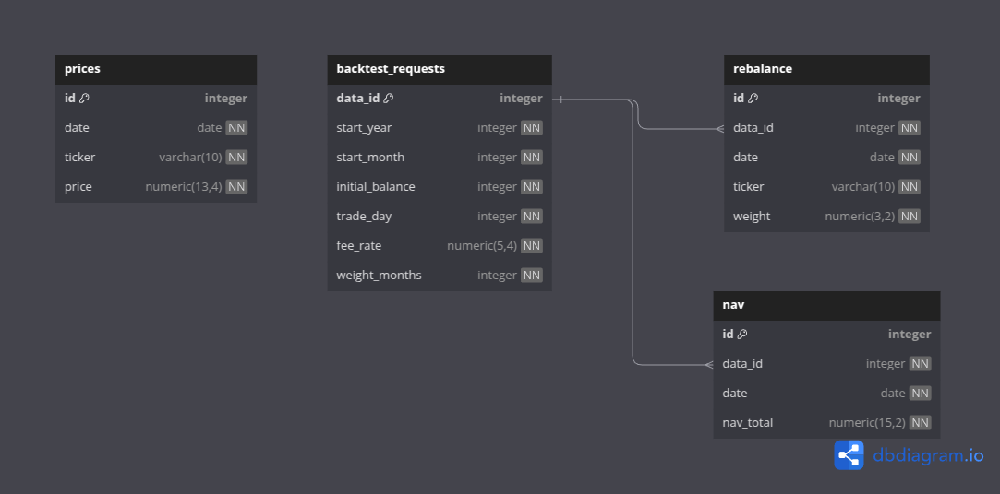

# 📊 백테스트 과제 자가평가

## 1. 🎞️ 설계

### 💡 내용
<p align="center">
    
</p>

- 데이터베이스 테이블 설계부터 ERD까지 정의했습니다. `Prices`, `BacktestRequest`, `Nav`, `Rebalance` 4개의 테이블로 구성되며, `BacktestRequest.data_id`를 기준으로 `Nav`, `Rebalance`과 관계를 맺도록 설계하였습니다.
- `data_id` 삭제 시 관련 데이터도 함께 삭제되도록 `cascade` 옵션을 활용해 기능 구현이 간결하도록 설계했습니다.
- API는 RESTful한 방식으로 설계하여 `POST`, `GET`, `DELETE` 메서드를 활용했습니다. 요구사항에 따라 `계산`, `조회`, `삭제` 기능을 구분했습니다.
- 백테스트 계산 로직은 Pandas 기반의 DataFrame을 활용해 수익률 계산, 리밸런싱, 수수료 반영을 명확하게 구현했습니다.
- ETF 목록은 DB에서 `distinct ticker`를 조회하여 동적으로 구성되며, 새로운 ETF가 추가되어도 코드 수정이 불필요하게 설계했습니다.

### ✅ 좋은 점
- 계산 로직과 DB 저장을 분리하여 유지보수성이 좋다고 생각합니다.
- 확장성과 실용성을 동시에 고려하였습니다.

### 🟥 아쉬운 점
- 초기단계에서 계산의 과정과 저장과정을 고려하지 않고 개발하여 구조를 뒤늦게 정리하였습니다.
- `ETF` 테이블을 만들어 `ticker`, `name`, `description` 를 정의하고 `Prices` 테이블과 연결짓지 못해 아쉬운 부분이 남습니다.

---

## 2. 💪 책임감

### 💡 내용
- 사용자가 입력한 날짜가 주말일 경우 앞선 평일로 조정되도록 로직을 설계했습니다. 예를 들어 월의 1일이 토요일이면 전월로 넘어가지 않도록 조정했습니다.
- trade_day가 31일일 경우, 31일이 존재하지 않는 월에 대해서는 해당 월의 말일로 자동 설정되도록 보완했습니다.
- 이러한 날짜 관련 처리방식을 올바르게 하기위해 담당자분께 문의하여 요구사항을 확인하고 반영했습니다.

- 과제 수행 기간(`3.15~3.23`) 중 월, 수, 목 아르바이트와 예비군 훈련(`3.18`)이 있는 일정 속에서도 꾸준히 개발을 진행하며 책임감을 갖고 끝까지 완수했습니다.

<p align="center">
    
</p>

### ✅ 좋은 점
- 일정이 빡빡한 상황에서도 프로젝트를 미루지 않고 끝까지 완수하며 책임을 다하기 위해 노력하였습니다.

### 🟥 아쉬운 점
- 테스트 코드를 만들지 못한 점이 아쉽습니다.

---

## 3. 🔍 꼼꼼함

### 💡 내용
- 상대경로 설정을 통해 배치 프로그램이 어떤 환경에서도 동작할 수 있게 설정했습니다. (디렉토리 구조 & 가상환경 명 일치 필요)
- price 데이터를 불러오지 못할 경우를 대비하여 에러 메시지를 출력하도록 예외처리를 구현했습니다.
- 매일 가격을 업데이트하는 배치 프로그램에서, 동일한 날짜·티커 데이터가 이미 존재할 경우 중복 삽입을 방지했습니다.
- 모델 정의 시 컬럼의 타입을 명확하게 지정해 데이터 오류를 사전에 방지했습니다.
- `schemas.py`에서 Pydantic를 통해 입력값에 대한 제약 조건(`ge`, `le`, `gt`, `lt`)을 설정하고 `field_validator`를 통해 검증 기능을 강화했습니다.


### ✅ 좋은 점
- 다양한 예외상황에 대해 꼼꼼하게 확인하여 안정성을 높이기 위해 노력하였습니다.

### 🟥 아쉬운 점
- field_validator 데코레이터를 사용하여 진행한 건 잘 하였다고 생각하지만 root_validator를 만들어 보지 못한 것이 아쉬움으로 남습니다. 추후 기회가 된다면 root_validator를 통해 아래 코드까지 검증하는 기능을 만들어보고 싶습니다.

```
min_date_db =  db.query(func.min(models.ETFPrice.date)).scalar()
    min_date = date(rq.start_year,rq.start_month,rq.trade_day) - relativedelta(months=rq.weight_months)
    
    if min_date < min_date_db:
        raise HTTPException(
            status_code= 400,
            detail=f"데이터가 {min_date_db.strftime('%Y-%m-%d')} 이후부터 존재합니다. 시작일로부터 {rq.weight_months}개월 전 데이터가 존재하지 않습니다."
        )
```
---

## 4. 🚀 성능

### 💡 내용
- Pandas의 DataFrame을 활용하여 반복문 최소화 하였으며 추후 검증을 위한 부분에 있어서 데이터프레임을 직접 확인하며 편리한 검증을 할 수 있도록 설계하였습니다.
- MDD 계산에 있어서도 pandas를 통한 벡터 연산보다 numpy(`maximum.accumulate`)를 사용하여 조금이라도 성능을 높이기 위해 노력하였습니다.
- ETF 리스트를 하드코딩하지 않고 DB에서 불러오도록 하여 새로운 ETF가 추가되어도 성능 저하 없이 유연하게 대응 가능하도록 구성했습니다.

### ✅ 좋은 점
- 확장성과 유연성을 고려하여 ETF를 DB에서 동적으로 불러오게 한 부분이 성능과 유지보수 측면에서 좋다고 생각합니다.


---

## 5. 🤝 협업

### 💡 내용
- `routes`, `services` 등으로 디렉토리 구조를 명확히 분리하여 협업 시 역할이 뚜렷하게 보이도록 구성했습니다.
- API의 입출력 스펙은 `schemas.py`에 모두 정의하여 명확한 입출력을 표현할 수 있도록 하였습니다.
- 협업을 가정하고 노션을 통해 진행 상황, 해야 할 일, 완료 여부 등을 기록하며 관리하고, `input 값 정의`, `제약식` 등을 공유하였습니다.
- WBS처럼 할 일을 세분화하고, 스스로 마감 기한 내 완료 여부를 확인하며 진행했습니다.
- git commit 시 메세지에 `내용` 혹은 `목표`등을 적어가며 진행상황을 체크할 수 있도록 하였습니다.


<p align="center">
    
    <em>- Task 정의 및 기간 설정 -</em>
</p>

<p align="center">
    
    <em>- 입력변수와 관련된 제약식 정의 -</em>
</p>

<p align="center">
    
    <em>- GitHub Issue 정리 화면 -</em>
</p>

### ✅ 좋은 점
- 문서화와 일정 관리부분에 있어서 협업을 가정하여 진행하였습니다.
- 변경사항이 발생함에 따라 git commit 메세지에 내용을 입력하고, 또한 해결해야할 문제 발생 시 git issue를 생성하여 원인과 해결과정을 기록하였습니다.

### 🟥 아쉬운 점
- 실제 협업에서 발생할 수 있는 문제(git merge, 의견 충돌, 방향성 수정 등)를 경험하지 못해 시뮬레이션 수준에 머물렀습니다.

---

## ✅ 마무리

이번 과제를 통해 단순한 기능 구현을 넘어서, 실제 서비스 수준을 고려한 설계, 구조화된 개발, 예외 처리까지 경험할 수 있었습니다. 특히 사용자 입력과 데이터 존재 유효성의 교차 검증, DB 설계의 cascade 처리, 계산 로직의 분리 등에서 꼼꼼함과 확장성 중심의 사고를 유지하기 위해 노력했습니다. 
본 과제 테스트의 의도가 잘 설계된것 같아 진행중에서도 감탄하며 즐겁게 할 수 있었던 것 같습니다. 아쉬운점과 부족했던점이 보이지만 꾸준히 피드백하며 성장해나가는 개발자가 되겠습니다. 감사합니다.